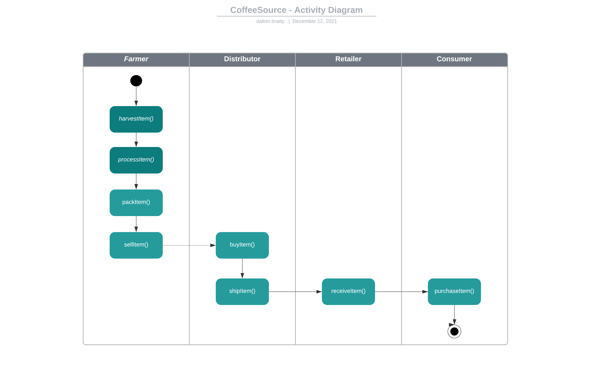
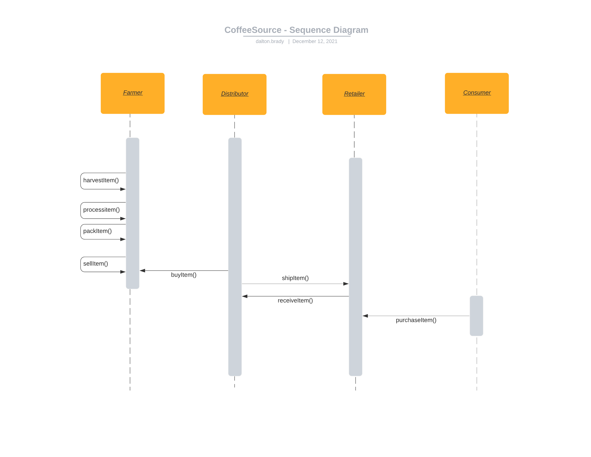
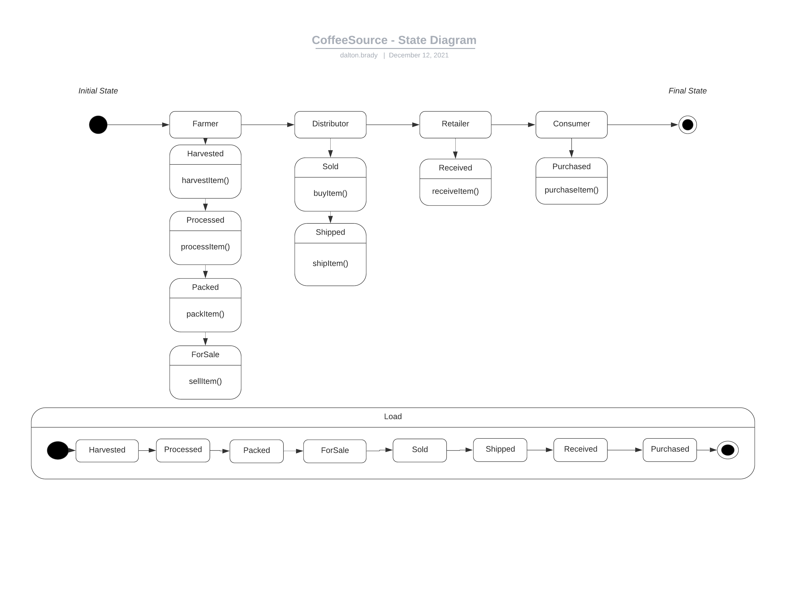
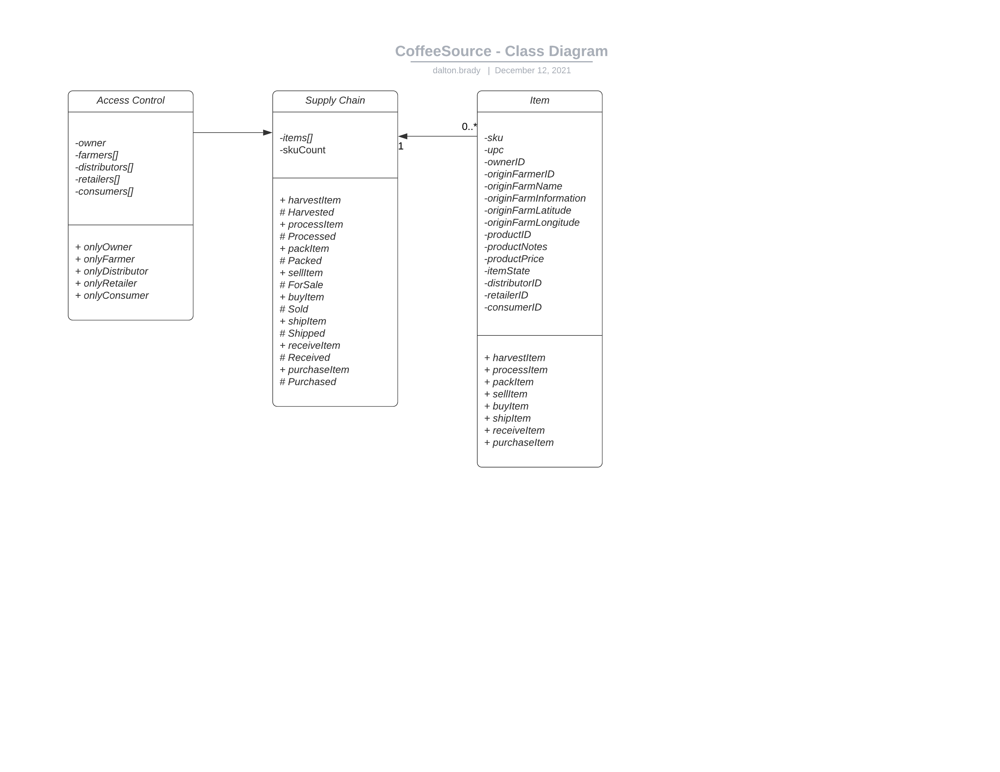

##Contract:
- rinkeby: 0xbe12CD7d07b9078F242F7aB3F6553BF4F2B699c8

## Dependencies
- node: v14.17.1
- truffle: v4.1.17
- solc: v0.4.26
- web3: 0.20.6

## Secrets:
- dapps/supply_p3/mnemonic.secret (Wallet to use with truffle)
- dapps/supply_p3/infura.secret (Project ID to use with infura)

## UML:

